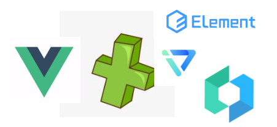
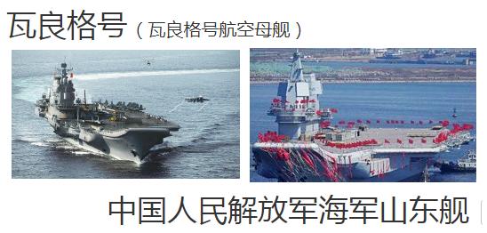
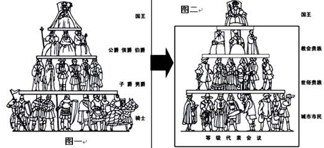

页面模块
负责
- 首页/登录注册/各种业务页面

接口模块
负责
- 增删改查逻辑相关的对接
- 剥离接口的开发与业务页面的开发
- 统一解决数据格式不一致性

插件模块
负责
- 所有懒加载插件的即时声明
- 所有懒加载插件的统一配置

路由模块
负责
- 方便简易的管理所有业务页面
- 任何业务页面的跳转鉴权
- 树形目录的节点管理
- 为各种需要路由信息的组件提供信息 如面包屑/历史标签/title管理 等

状态模块
负责
- 系统操作 如切换语言/切换主题
- 登陆管理员的各种操作
- 各种组件的通信管理

公共样式模块
负责
- 登录注册主页等单独样式
- UI框架复写样式
- 特殊的常用样式 指一些漂亮的小技巧

公共方法模块
负责
- UI框架的常用操作 如错误提示/信息确认/保存url参数等
- 常用的js操作 均有对应的单元测试检验

全局控制模块
负责
- 负责如 短信发送间隔时间/console开关/错误信息收集上报 等全局参数

## 模块分离 设计目的
搞一套功能全面 更低耦合 代码集中 各司其职 层级明确 的项目结构
我们的目标是 高度可靠 随时加随时卸 快速迭代

## 模块分离 更低耦合
模块间的耦合度是指模块之间的依赖关系，包括控制关系、调用关系、数据传递关系。模块间联系越多，其耦合性越强，同时表明其独立性越差。
我们的团队目前使用了三种基于vue的Ui框架 如果每个框架都搞一套标准就太累了
何不将三套内容不同的地方抽取出来做成单独
想换框架就换框架

就像俄罗斯瓦格良号变身山东舰

## 模块分离 代码集中
相同逻辑的代码集中在一起 互相借鉴 评审 变的很方便
相同的功能想抄错都难 如果真的错了 留在那里很显眼

###### 举个栗子
签证美国
A想去美国 但是得签证 于是A自己找资料自己填表 但是因为经验不足每次都被拒
B看到这个情况 主动拉着A加入一个社团 学习并分享签证经验
于是 他们都通过了签证

###### 这个例子对应的项目问题有
- 甲开发者辛苦开发了某个逻辑流程 乙开发者又相似需求却完全不知情重新开发

###### 这个特性带来的好处

同类型的代码集中在一起 就像一个停车场管理员将他的地盘管理成这样
对于强迫症患者来说真的很舒服 更重要的是后来的人会自觉地按号入座

## 模块分离 各司其职
###### 引申说明
蜜蜂是一种社会性昆虫，不能以个体生存，它们集体生活在蜂巢或养蜂人为它们提供的“蜂箱”里。它们分工明确、各司其职、精诚合作，总是圆满完成各自所负的任务，保证了蜜蜂王国的安定和谐、繁荣昌盛，使蜂蜜王国形成了一个绝对高效的集体。

###### 举个栗子
峰后叫工蜂照看幼虫(雄峰的工作) 工蜂说不会
于是峰后叫雄峰去采蜜和打仗(工峰的工作) 雄峰觉得我能干的了就去了
然后它就被其他工蜂嘲笑了 因为干不好

###### 这个例子对应的项目问题有
- 本该路由模块负责的跳转变化却都堆在状态模块
- 本该路由模块负责的鉴权却声明watch在main.js
- 本该接口模块负责的参数转换下放到各个业务逻辑页面

###### 这个特性带来的好处
什么模块负责什么功能 想加就加 想卸就卸

## 模块分离 层级明确
###### 引申说明
自古以来 等级制度就一直存在 每个当权者都会把自己的责任和权力看成自己神圣的一部分
欧洲在古罗马，有贵族、骑士、平民和奴隶等级。

###### 举个栗子
一群妖怪盖房子
洋葱头妖怪头领因为长的高大, 一只手就能搞定了盖房子的事情,
但是他懒他不干 于是所有他手下的洋葱头小喽啰每人拿一块砖头哼哧哼哧的盖房子

###### 这个例子对应的项目问题有
- vue/iview 全局配置声明在每个业务页面内
- 全局样式声明在各种结构内
- 非常用组件声明在全局配置中

###### 模块功能细分不明确
- 一级结构可以做到的 不要分散排分任务到所有的下级
- 只是某个小业务需要的 不要声明加载在全局

代码清晰 ESlint 团队开发规范
- 程序开发的黄金准则: 让所有参入开发者的产出都像是同一人手笔

代码清晰 易读性
- 外行看开发者作品好坏的标准 - 运行不出错
- 同行看开发者作品好坏的标准 - 接手好维护

代码清晰 合理性
明确方法声明的方式

代码清晰 注释注释注释
- 每一行一个注释

代码清晰 ES6学习
- 锦上添花

代码清晰 名称语义化
- 需要用户手动触发的方法起名以handle开头来表达调用方式
- 使用英文(超过8个字母则适当使用缩写)开头来表达功能
- 如果方法体内存在异步调用(请尽量使用api模块来规范)使用Ajax作为结尾来暗示
- 将所有的方法按照功能模块来顺序放置
- 如果有重复的功能按钮 则使用xxxxx4other 4=for 即在主线外有分线
- 分线之后注明分线的功能 如 xxxx4UserEdit
- 分线最后要注明分线的触发方式 如 model代表弹框内容
- 一些每个页面只有一次使用的方法 强制指定名字 如init
- handle 可以使用在 @click @on-change @bulr
- get/set // 代表 [设置页面变量] 如果你的方法主要是ajax 就不要用了
- submit // 代表 [表单提交]
- rander // 代表 [页面渲染]
- init // 代表 [页面初始化]

handleDownload // 代表 [用户触发][下载] 功能
handleSearch // 代表 [用户触发][搜索] 功能
hendleGopage // 代表 [用户触发][切换分页] 功能
handleOrder // 代表 [用户触发][排序] 功能
hendleReset // 代表 [用户触发][重置] 功能

handleSubmitAjax //代表 [用户触发][表单提交][ajax请求] 功能
handleSubmitAjax4UserEditModel //代表 [用户触发][表单提交][ajax请求][用户编辑][弹窗] 功能

如果方法仅仅负责改变一个值
cancelSub () {
    this.dialogShop = false;
},
不建议这么写 直接在 @click="dialogShop=false"

- 请使用箭头函数 尽量不要使用 me = this (感觉很low)

- 请使用 继承/深拷贝 的方式来获取定义的obj (尽量减少业务字段的出现次数 减少可能的写错字bug)

- 你用英语问导游"where are we"
- 导游脑中翻译了一下 "我们现在在哪"
- 导游有了答案 将答案翻译成英语
- "toilet"

- 让常用的 逻辑结构(导游) 独立出来并负责多一点内容

- 正文是一个字 注释却有七八行
- 编译的过程中默认是将注释消灭的 所以注释不会拖慢项目速度
